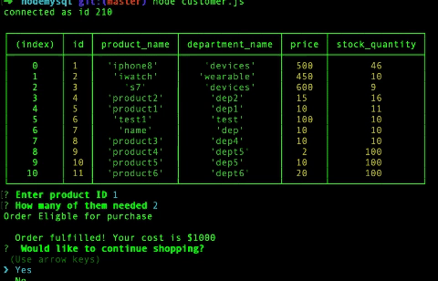
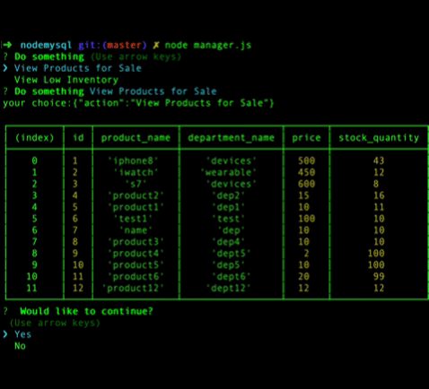

# node mysql

Amazon-like storefront using MySQL and Node.js. It is comprised of two apps - one for customer orders and one for manager actions. Uses basic functions of persistant storage. Using CRUD database operations used - INSPECT, SELECT, UPDATE SQL queries.

Customer:

- displays a table with the inventory
- takes a customer's order
- computes the cost
- depletes the stock from the store's inventory

Manager can do below actions:

- View Products for Sale
- View Low Inventory
- Add to Inventory
- Add New Product

Technologies Used:

The following technologies and tools were used

- JavaScript
- node.js
- MySQL Workbench